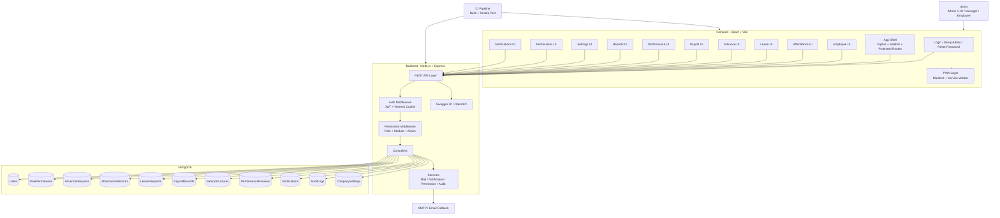
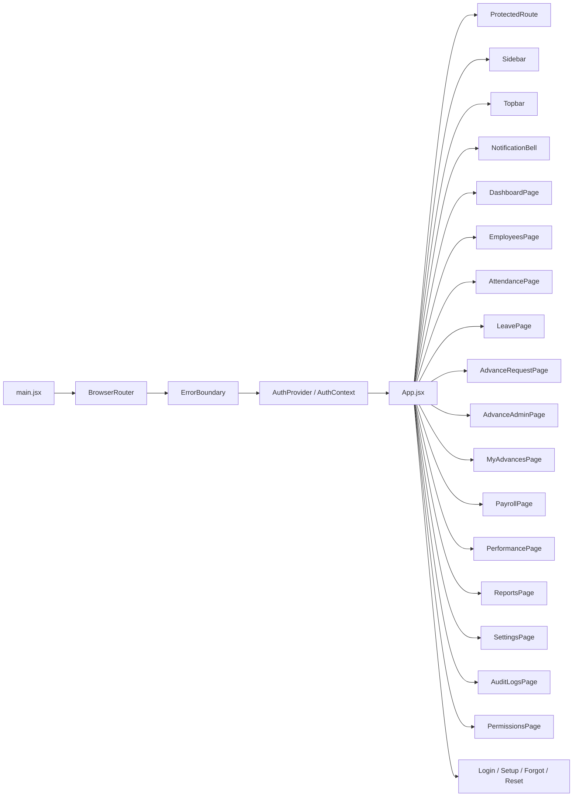
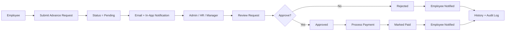
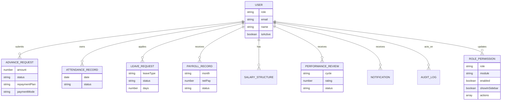

# HRMS Architecture Diagram

This document captures the **current implementation architecture** of the HRMS project as built so far.

---

## 1) High-Level System Architecture



---

## 2) Frontend Architecture



### Frontend key patterns
- **AuthContext** stores logged-in user and permissions.
- **ProtectedRoute** checks auth and permission before page access.
- **Sidebar** now depends on module visibility + permission rules.
- **PermissionsPage** is intended to control role-level module access and sidebar visibility.
- **NotificationBell** reads in-app notifications from backend.

---

## 3) Backend Architecture

```mermaid
flowchart TB
    SERVER[server.js]
    APP[app.js]
    ROUTES[index.js]

    subgraph MW[Middleware]
        CORS[CORS]
        JSON[express.json]
        COOKIE[cookie-parser]
        LOG[morgan]
        AUTH[authenticate]
        PERM[checkPermission]
        ERR[errorHandler]
    end

    subgraph RT[Route Modules]
        R1[auth.routes]
        R2[employee.routes]
        R3[attendance.routes]
        R4[leave.routes]
        R5[advance.routes]
        R6[payroll.routes]
        R7[performance.routes]
        R8[report.routes]
        R9[settings.routes]
        R10[notification.routes]
        R11[audit.routes]
        R12[permission.routes]
    end

    subgraph CT[Controllers]
        C1[auth.controller]
        C2[employee.controller]
        C3[attendance.controller]
        C4[leave.controller]
        C5[advance.controller]
        C6[payroll.controller]
        C7[performance.controller]
        C8[reports.controller]
        C9[settings.controller]
        C10[notification.controller]
        C11[audit.controller]
        C12[permission.controller]
    end

    SERVER --> APP
    APP --> CORS
    APP --> JSON
    APP --> COOKIE
    APP --> LOG
    APP --> ROUTES
    ROUTES --> R1 --> C1
    ROUTES --> R2 --> C2
    ROUTES --> R3 --> C3
    ROUTES --> R4 --> C4
    ROUTES --> R5 --> C5
    ROUTES --> R6 --> C6
    ROUTES --> R7 --> C7
    ROUTES --> R8 --> C8
    ROUTES --> R9 --> C9
    ROUTES --> R10 --> C10
    ROUTES --> R11 --> C11
    ROUTES --> R12 --> C12
    APP --> ERR
```



---

## 4) Current HRMS Module Breakdown

```mermaid
flowchart TB
    HRMS[HRMS Modules]

    HRMS --> M1[Auth + Setup]
    HRMS --> M2[Employee Management]
    HRMS --> M3[Attendance]
    HRMS --> M4[Leave Management]
    HRMS --> M5[Advance Requests - Priority Module]
    HRMS --> M6[Payroll]
    HRMS --> M7[Performance]
    HRMS --> M8[Reports]
    HRMS --> M9[Settings]
    HRMS --> M10[Notifications]
    HRMS --> M11[Audit Logs]
    HRMS --> M12[Permissions Management]

    M1 --> M1A[Register / Login / Refresh / Forgot / Reset]
    M2 --> M2A[Directory / Profile / Org Chart / Create / Update / Deactivate]
    M3 --> M3A[Check-in / Check-out / Summary / Regularization]
    M4 --> M4A[Apply Leave / Approve / Reject / Balances]
    M5 --> M5A[Request / Review / Approve / Reject / Pay / History]
    M6 --> M6A[Salary Structure / Payroll Run / Mark Paid]
    M7 --> M7A[Review / Goals / Rating / Feedback]
    M8 --> M8A[Overview Metrics]
    M9 --> M9A[Company Settings / Holidays / Leave Types]
    M10 --> M10A[Unread Count / Read / Read All]
    M11 --> M11A[Audit Trail]
    M12 --> M12A[Role Matrix / Sidebar Visibility / Delegable Access]
```



---

## 5) Priority Advance Request Flow



---

## 6) Permission Management Architecture (Current Direction)

```mermaid
flowchart TB
    ADMIN[Admin or Role with permissions.edit]
    UI[PermissionsPage UI]
    API[/api/permissions/*]
    PMW[checkPermission('permissions', ...)]
    PC[permission.controller]
    PS[permission.service]
    RP[(RolePermissions)]
    AL[(AuditLogs)]
    USER[(Users)]
    SIDEBAR[Dynamic Sidebar Rendering]
    AUTHCTX[AuthContext]

    ADMIN --> UI
    UI --> API
    API --> PMW
    PMW --> PC
    PC --> PS
    PS --> RP
    PC --> AL

    USER --> AUTHCTX
    RP --> AUTHCTX
    AUTHCTX --> SIDEBAR
    AUTHCTX --> UI
```

### Permission model implemented direction
For each **role + module**, the system is moving toward storing:
- `enabled`
- `showInSidebar`
- `actions[]`

This enables:
- role-based module access
- role-based action control
- role-based sidebar visibility
- delegating permission control to another role later

---

## 7) Data Layer Summary



---

## 8) Current Delivery Status in Architecture Terms

### Implemented and present
- React frontend with responsive pages
- Express API backend
- MongoDB models for core HRMS domains
- JWT auth + refresh flow
- Notification layer
- Audit logging
- Swagger docs
- Permission-management foundation
- Dynamic protected routes and sidebar logic

### In-progress / latest architecture addition
- Role-based permission matrix with sidebar visibility
- Delegable permission-management access
- Deeper full-system enforcement across all modules

---

## 9) Suggested Next Diagram After Completion
Once permission implementation is fully stabilized, the next architecture diagram should show:
- full permission enforcement map for every route
- exact module-to-action matrix
- role-to-sidebar rendering matrix
- permission change propagation flow

---

If needed, I can also create:
1. a **clean PNG architecture diagram**
2. a **draw.io style architecture document**
3. a **module-wise low-level design diagram**
4. a **database ER diagram only**
